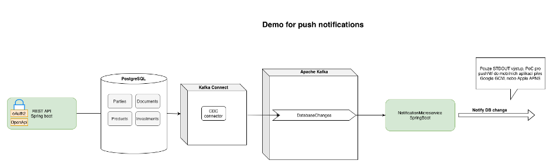

# ppro_push-ntf-system
Toto je školní projekt pro předmět "Pokročilé programování"

## Schéma aplikace:


## Instalace
- je možné spustit plně lokálně
- spustit pomocí: ```docker-compose -p ppro up -d```

### Postup včetně buildu aplikace:

1) ```mvn clean install``` - na úrovni root adresáře projektu
2) ```docker-compose -p ppro build```
3) ```docker-compose -p ppro up```

>   Pro správné a automatické spuštění CDC Debezium connectoru je nastaveno na spouštění aplikace 30s sleep (ideální by bylo naimplementovat v shellu healtcheck), aby se stihl načíst Kafka Connect a začal přijímat requesty..

### Swagger-UI URL - pro provolávání API přes UI:

http://localhost:8080/swagger-ui/index.html?configUrl=/v3/api-docs/


- clientId: client-id
- clientSecret: client-secret

### Příklady CURL volání pro získání access tokenu - oAuth2
```
curl --user 'client-id:client-secret' --location --request POST 'http://localhost:8080/oauth/token' \
--header 'Content-Type: application/x-www-form-urlencoded' \
--data-urlencode 'grant_type=client_credentials'
```

